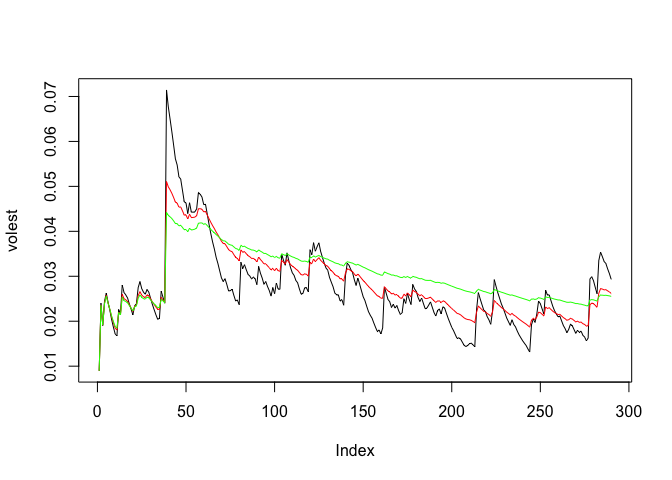

Unit11
================

Time series analyis
===================

### Install "tseries" library if necessary

``` r
install.packages('tseries')
```

### Use the "tseries" package

``` r
library('tseries')
```

#### Get SNP data for quote symbol "PEN"

``` r
SNPdata = get.hist.quote('PEN', quote='Close')
```

    ## time series starts 2015-09-21
    ## time series ends   2016-11-11

### Calculate log returns

``` r
SNPret = log(lag(SNPdata)) - log(SNPdata)
```

### Function to get the volatility given d

The arg `d` is the weight (1 - 1/d will be between 0 -1) and `logrets` is the log return caclulated from above. This function was provided by Professor McGee. All rights reserved.

``` r
getVol = function(d, logrets) {
  var = 0
  lam = 0
  varlist = c()
  for (r in logrets) {
    lam = lam*(1 - 1/d) + 1
    var = (1 - 1/lam)*var + (1/lam) * r^2
    varlist = c(varlist, var)
  }
  
  sqrt(varlist)
}
```

### Calculate volatility from 3 different d values

``` r
volest = getVol(10, SNPret)
volest2 = getVol(30, SNPret)
volest3 = getVol(100, SNPret)
```

### Plot the different lines of volatility

As we can see by the graph, we have a fairly volatile dataset, but probably less volatile than the S&P dataset.

``` r
plot(volest, type="l")
lines(volest2, type="l", col='red')
lines(volest3, type="l", col='green')
```


